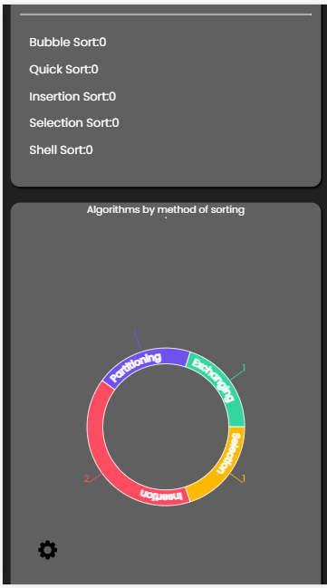

This project was bootstrapped with [Create React App](https://github.com/facebook/create-react-app).

# <strong>Sorting algorithms website in React</strong>

<hr/>
Simple two page client-side rendering application, which allows users to measure times of various sorting algorithms, with possibility to adjust settings like size of an array, number of test cases for particular iteration, distribution of data in arrays and direction of sorting.
Apart from that, user is able to view sorting process on small fixed dataset.

## <strong>Table of contents</strong>

- [General info](#general-info)
- [Design](#design)
- [Technologies](#technologies)
- [Images](#images)
- [Tests](#tests)
- [Setup](#setup)
<hr/>

## <strong>General info</strong>

Page is rendered on the client side using React-Router and uses web/service worker to move large and time consuming computations to another thread, what makes website interactive during sorting large size arrays multiple times per dataset. Visualization is done by converting algorithm implementation to generator function, which yields state of an array after each iteration of the algorithm. The data is then displayed using bar chart. Class components are nowhere to be found - all components are written as function components and all of them make use of hooks API. Redux stores three big chunks of information: 1. References to all algorithms with their description, name, etc. as an array, 2. tests object consisting of all options to test algorithms defined by user (length of an array, min and max sizes, data distribution and so on), 3. object with helps with searching and sorting algorithms, which stores for example user input in search bar or order of the displayed algorithms in the main page.<hr/>

## <strong>Design</strong>

The main concept for the application's look was created in Figma, alongside with concept main page and algorithm page. Note that dark theme was not taken into consideration until lasts production steps.

<iframe style="border: 1px solid rgba(0, 0, 0, 0.1);" width="800" height="450" src="https://www.figma.com/embed?embed_host=share&url=https%3A%2F%2Fwww.figma.com%2Ffile%2FzYMyfdaV0nViJkQYSGDcc4%2FSorting-algorithms-react-app%3Fnode-id%3D8939%253A63" allowfullscreen></iframe><hr/>

## <strong>Technologies</strong>

1. Main core of the project is created with:

- React version: 17.0.2
- React-dom version: 17.0.2
- Redux version: 4.0.5
- React-redux version: 7.2.3
- React router dom: 5.2.0
- Sass version: 1.32.10
- Recharts version: 2.0.9
- Enzyme version: 3.11.0

2. Additional npm libraries:

- Moment version: 2.29.1
- Numeral version: 2.0.6
- Reselect version: 4.0.0
- Flow version: 0.148.0
- Workerize-loader version: 1.3.0
- Enzyme-toJSON version: 3.6.2
- @wojtekmaj/enzyme-adapter-react-17 version: 0.6.1

All installed modules can be found in package.json.<hr/>

## <strong>Images</strong>

Versions with light and dark themes enabled.<br/>
On the main page user is able to compare all algorithm implementation (5) on one bar chart.


Algorithm page, where user is able to track best, worst and average time of a certain sorting step with size of an array displayed on the X-axis and time on Y-axis.<br/>
A visualization chart on the right side enables user to see algorithm in action - each step of the algorithm is labeled and visible to user.<br/>


Settings modal, allowing user to adjust testing options to fit their need:<br/>


Small video of how te visualization process looks like:<br/>


The website is also adjusted to mobile devices:<br/>




<hr/>

## <strong>Tests</strong>

Testing was done using Jest and Enzyme, what was more than enough to test shallow rendering and behaviour of certain inputs, buttons, radiobuttons as well as sorting implementations and whole redux/react-redux combination (actions, reducers, selectors)<br/>
Test coverage in terminal

Test coverage in web


<hr/>

## <strong>Setup</strong>

To run this project, clone it and run it using scripts defined in package.json:

```
$ git clone https://github.com/piotr-rzepa/sorting-algorithms-react-project.git
$ npm init
```

From now on, you have two options, either run it using script (run keyword can be omitted):

```
$ npm run start
```

It will start development version of the application on localhost:3000

Or creating production version of the application, ready for deployment

```
$ npm run build
```

The application didn't mean to be deployed for Heroku (in comparision to my other applications) so it's necessary to create run script in order to enable Heroku to run the appication, as well as perhaps eject the project to get access to things like webpack and its configuration, which at its current state is abstracted away by create react app.
